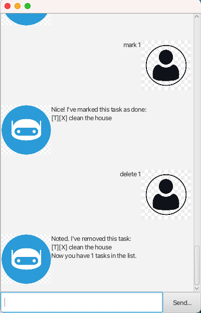

# Aegis User Guide



_Aegis_ is a **command-line task management chatbot** built in **Java**, designed to help users manage their tasks efficiently. It supports adding, deleting, listing, and organizing tasks such as **Todos, Deadlines, and Events** with an easy-to-use command system.

---

## ✨ Features

✅ **Task Management:** Add, delete, and list various tasks (_Deadlines_, _Events_, _Todos_)  
✅ **Mark & Unmark Tasks:** Easily mark tasks as done or not done  
✅ **Sorting & Listing:** View all tasks or sort them by upcoming due dates  
✅ **Search Functionality:** Find tasks by name  
✅ **Error Handling:** Provides feedback for invalid commands

---

## 📜 Commands

### 📝 Task Management

#### ✅ Mark a Task as Done
- **Command:** `mark <task number>`
- **Example:** `mark 2` (Marks task 2 as completed)
- **Expected Outcome:**
```
Nice! I've marked this task as done:
[T][X] clean the house
```
- **Note:** `<task number>` must be greater than 0.

#### ❌ Unmark a Task as Not Done
- **Command:** `unmark <task number>`
- **Example:** `unmark 2` (Marks task 2 as not completed)
- **Expected Outcome:**
```
OK, I've marked this task as not done yet:
[T][ ] clean the house
```
- **Note:** `<task number>` must be greater than 0.

#### ➕ Add a Task
- **Command (Todo):** `todo <task name>`
   - Example: `todo Read book`
   - **Expected Outcome:**
       ```
       Got it. I've added this task:
       [T][ ] clean the house
       Now you have 1 tasks in the list.
       ```
- **Command (Deadline):** `deadline <task name> /by <date & time>`
   - Example: `deadline Submit report /by 02/15/2025 18:00`
   - **Expected Outcome:**
       ```
       Got it. I've added this task:
       [D][ ] Submit report (by: 15/2/2025 18:00)
       Now you have 1 tasks in the list.
       ```
- **Command (Event):** `event <task name> /from <date time> /to <date time>`
   - Example: `event Team meeting /from 02/20/2025 14:00 /to 02/20/2025 16:00`
   - **Expected Outcome:**
     ```
     Got it. I've added this task:
     [E][ ] Team meeting (from: 20/2/2025 14:00 to: 20/2/2025 16:00)
     Now you have 1 tasks in the list.
     ```
- **Note:** Date format must be **MM/DD/YYYY HH:mm**.
- **Note 2:** If there is a duplicated item, you will be warned and item will not be added.

#### 🗑️ Delete a Task
- **Command:** `delete <task number>`
- **Example:** `delete 3` (Deletes task 3)
- **Expected Outcome:**
  ```
    Noted. I've removed this task:
    [T][ ] lol
    Now you have 2 tasks in the list.
  ```
- **Note:** `<task number>` must be greater than 0.

---

### 📂 Listing Tasks

#### 📜 List All Tasks
- **Command:** `list`
- **Expected Outcome:**
  ```
  Here are the tasks in your list:
  1. [D][ ] Task A (by: 12/2/2020 19:00)
  2. [D][ ] Task B (by: 12/2/2009 18:00)
  ```
- **Description:** Displays all tasks.

#### 📆 List Tasks by Due Dates
- **Command:** `duedates`
- **Expected Outcome:**
```
Here are the upcoming due dates in your list:
1. [D][ ] Task B (by: 12/2/2009 18:00)
2. [D][ ] Task A (by: 12/2/2020 19:00)
```
- **Description:** Lists only _Deadlines_ and _Events_, sorted by the earliest due date first.

---

## 🚀 Installation

1. **Download the latest Aegis JAR file** [here](https://github.com/aquaimpact/ip/releases)
2. **Place it in a folder of your choice**
3. **Run it with the following command:**  `java -jar aegis.jar`
4. Start managing your tasks efficiently! 🎯

---

## 📌 Current Progress :clipboard:

- [x] Implement core chatbot functionality (Add, List, Delete tasks)
- [x] Refactor using **Object-Oriented Programming (OOP)**
- [x] Develop a **Graphical User Interface (GUI)** using JavaFX

---
Here is where your save file is saved at!
```java
public static void main(String[] args) {
        new Aegis("./save.txt").run();
}
```

> _"A goal without a plan is just a wish."_ – Antoine de Saint-Exupéry

📌 **Aegis: Your reliable task manager, built to shield your productivity!**